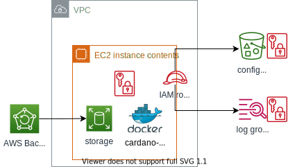

# terraform-aws-cardano-node

[](https://github.com/leb4r/terraform-aws-cardano-node/actions/workflows/checkov.yml) [](https://github.com/leb4r/terraform-aws-cardano-node/actions/workflows/pre-commit.yml)

Terraform module that provisions infrastructure on AWS to run [cardano-node]. There are [examples](./examples) that give a good idea on how to best use this project in your own.

## Security

This project has not be audited for security by a third-party. Use at your own discretion. However, there are periodic scans performed by [checkov](https://github.com/bridgecrewio/checkov), results can be found in [workflow results](https://github.com/leb4r/terraform-aws-cardano-node/actions/workflows/checkov.yml).

## Architecture

This module is setup to be flexible. It can be used in whole, or you can opt to use the individual modules separately found in the `modules/` directory.

### Basic Architecture

Right now, the only supported compute type is EC2, which is outlined in the [basic example](./examples/basic). The [node module](./modules/node) finds the latest Amazon Linux AMI and provisions an EC2. The userdata is setup to install `docker` and `docker-compose` which is how [cardano-node] is orchestrated. It will also attempt to attach an EBS volume to use as storage for the ledger. Configuration (docker-compose.yml, topology.json, etc) are synced from an S3 bucket. KMS encryption is used where possible, the EBS volume is apart of a backup plan by default, and logs are written to a specific CloudWatch Log Group.

This is a very basic architecture, but it demonstrates the technology.



## Usage

This example my be using a `version` that is out-of-date, check [the registry page](https://registry.terraform.io/modules/leb4r/cardano-node/aws/latest) for the most recent usage.

```hcl
module "cardano-node" {
  source  = "leb4r/cardano-node/aws"
  version = "2.0.0"
  # insert the required variables here
}
```

## Operations

The [automation module](./modules/automation) provides SSM documents that can be used to perform operational tasks on the services.

<!-- references -->
[cardano-node]: https://github.com/input-output-hk/cardano-node

<!-- BEGINNING OF PRE-COMMIT-TERRAFORM DOCS HOOK -->
## Requirements

| Name                                                                      | Version   |
| ------------------------------------------------------------------------- | --------- |
| <a name="requirement_terraform"></a> [terraform](#requirement\_terraform) | >= 0.13.0 |
| <a name="requirement_aws"></a> [aws](#requirement\_aws)                   | ~> 3.0    |

## Providers

| Name                                              | Version |
| ------------------------------------------------- | ------- |
| <a name="provider_aws"></a> [aws](#provider\_aws) | ~> 3.0  |

## Modules

| Name                                                               | Source               | Version |
| ------------------------------------------------------------------ | -------------------- | ------- |
| <a name="module_automation"></a> [automation](#module\_automation) | ./modules/automation | n/a     |
| <a name="module_backups"></a> [backups](#module\_backups)          | ./modules/backup     | n/a     |
| <a name="module_config"></a> [config](#module\_config)             | ./modules/config     | n/a     |
| <a name="module_dns"></a> [dns](#module\_dns)                      | ./modules/dns        | n/a     |
| <a name="module_iam"></a> [iam](#module\_iam)                      | ./modules/iam        | n/a     |
| <a name="module_kms"></a> [kms](#module\_kms)                      | ./modules/kms        | n/a     |
| <a name="module_logs"></a> [logs](#module\_logs)                   | ./modules/logs       | n/a     |
| <a name="module_node"></a> [node](#module\_node)                   | ./modules/node       | n/a     |

## Resources

| Name                                                                                                     | Type        |
| -------------------------------------------------------------------------------------------------------- | ----------- |
| [aws_subnet.this](https://registry.terraform.io/providers/hashicorp/aws/latest/docs/data-sources/subnet) | data source |

## Inputs

| Name                                                                                                                      | Description                                                                                                                     | Type          | Default                                | Required |
| ------------------------------------------------------------------------------------------------------------------------- | ------------------------------------------------------------------------------------------------------------------------------- | ------------- | -------------------------------------- | :------: |
| <a name="input_associate_public_ip_address"></a> [associate\_public\_ip\_address](#input\_associate\_public\_ip\_address) | Set to `false` to only create allocate a private IP address for the node                                                        | `bool`        | `true`                                 |    no    |
| <a name="input_backup_cold_storage_after"></a> [backup\_cold\_storage\_after](#input\_backup\_cold\_storage\_after)       | Specifies the number of days after creation that a recovery point is moved to cold storage                                      | `number`      | `30`                                   |    no    |
| <a name="input_backup_delete_after"></a> [backup\_delete\_after](#input\_backup\_delete\_after)                           | Specifies the number of days after creation that a recovery point is deleted. Must be 90 days greater than `cold_storage_after` | `number`      | `180`                                  |    no    |
| <a name="input_backup_schedule"></a> [backup\_schedule](#input\_backup\_schedule)                                         | A CRON expression specifying when AWS Backup initiates a backup job                                                             | `string`      | `"cron(0 12 * * ? *)"`                 |    no    |
| <a name="input_cardano_node_image"></a> [cardano\_node\_image](#input\_cardano\_node\_image)                              | Container image to use for the node                                                                                             | `string`      | `"docker.io/inputoutput/cardano-node"` |    no    |
| <a name="input_cardano_node_network"></a> [cardano\_node\_network](#input\_cardano\_node\_network)                        | The cardano network to connect to (e.g. `mainnet` or `testnet`)                                                                 | `string`      | `"mainnet"`                            |    no    |
| <a name="input_cardano_node_port"></a> [cardano\_node\_port](#input\_cardano\_node\_port)                                 | The port to listen for communication on                                                                                         | `number`      | `3001`                                 |    no    |
| <a name="input_cardano_node_topology_json"></a> [cardano\_node\_topology\_json](#input\_cardano\_node\_topology\_json)    | JSON string to be used as topology config                                                                                       | `string`      | `""`                                   |    no    |
| <a name="input_cardano_node_version"></a> [cardano\_node\_version](#input\_cardano\_node\_version)                        | Version of cardano-node to run                                                                                                  | `string`      | `"1.30.1"`                             |    no    |
| <a name="input_create_kms_key"></a> [create\_kms\_key](#input\_create\_kms\_key)                                          | Set to `false` to use separate KMS key                                                                                          | `bool`        | `true`                                 |    no    |
| <a name="input_create_route53_record"></a> [create\_route53\_record](#input\_create\_route53\_record)                     | Set to `true` to create an A record in Route 53 for the EC2 instance                                                            | `bool`        | `false`                                |    no    |
| <a name="input_data_volume_size"></a> [data\_volume\_size](#input\_data\_volume\_size)                                    | Size of data volume of the node                                                                                                 | `number`      | `30`                                   |    no    |
| <a name="input_ebs_optimized"></a> [ebs\_optimized](#input\_ebs\_optimized)                                               | Set to `false` is disable EBS optimized feature                                                                                 | `bool`        | `true`                                 |    no    |
| <a name="input_enable_monitoring"></a> [enable\_monitoring](#input\_enable\_monitoring)                                   | Set to `false` to disable enhanced monitoring for node                                                                          | `bool`        | `true`                                 |    no    |
| <a name="input_instance_type"></a> [instance\_type](#input\_instance\_type)                                               | The type of instance to use for the node                                                                                        | `string`      | `"t3.large"`                           |    no    |
| <a name="input_kms_key_arn"></a> [kms\_key\_arn](#input\_kms\_key\_arn)                                                   | The ARN of the KMS CMK to use for encryption                                                                                    | `string`      | `""`                                   |    no    |
| <a name="input_log_retention_in_days"></a> [log\_retention\_in\_days](#input\_log\_retention\_in\_days)                   | The number of days to keep logs in the Log Group                                                                                | `number`      | `30`                                   |    no    |
| <a name="input_name"></a> [name](#input\_name)                                                                            | Canocial name to give to resources                                                                                              | `string`      | `"cardano-node"`                       |    no    |
| <a name="input_prometheus_ingress_cidrs"></a> [prometheus\_ingress\_cidrs](#input\_prometheus\_ingress\_cidrs)            | Comma-delimited list of CIDR blocks from which to allow Prometheus traffic on                                                   | `string`      | `"0.0.0.0/0"`                          |    no    |
| <a name="input_root_volume_size"></a> [root\_volume\_size](#input\_root\_volume\_size)                                    | Size of root volume of the node                                                                                                 | `number`      | `8`                                    |    no    |
| <a name="input_route53_record_name"></a> [route53\_record\_name](#input\_route53\_record\_name)                           | Name of the record to create                                                                                                    | `string`      | `""`                                   |    no    |
| <a name="input_route53_zone_id"></a> [route53\_zone\_id](#input\_route53\_zone\_id)                                       | ID of the Route 53 Zone to create record in                                                                                     | `string`      | `""`                                   |    no    |
| <a name="input_subnet_id"></a> [subnet\_id](#input\_subnet\_id)                                                           | ID of Subnet to deploy node in                                                                                                  | `string`      | n/a                                    |   yes    |
| <a name="input_tags"></a> [tags](#input\_tags)                                                                            | Map of tags to apply to resources                                                                                               | `map(string)` | `{}`                                   |    no    |
| <a name="input_vpc_id"></a> [vpc\_id](#input\_vpc\_id)                                                                    | ID of VPC to deploy node in                                                                                                     | `string`      | n/a                                    |   yes    |

## Outputs

| Name                                                                                           | Description                                         |
| ---------------------------------------------------------------------------------------------- | --------------------------------------------------- |
| <a name="output_config_bucket_name"></a> [config\_bucket\_name](#output\_config\_bucket\_name) | Name of S3 bucket used to store config              |
| <a name="output_data_volume_id"></a> [data\_volume\_id](#output\_data\_volume\_id)             | ID of EBS volume used for data storage              |
| <a name="output_dns_fqdn"></a> [dns\_fqdn](#output\_dns\_fqdn)                                 | FQDN of the node                                    |
| <a name="output_iam_role_name"></a> [iam\_role\_name](#output\_iam\_role\_name)                | Name of IAM role used by the EC2 instance           |
| <a name="output_instance_id"></a> [instance\_id](#output\_instance\_id)                        | ID of the EC2 instance where cardano-node is runner |
| <a name="output_security_group_id"></a> [security\_group\_id](#output\_security\_group\_id)    | ID of the Security Group used by EC2 instance       |
<!-- END OF PRE-COMMIT-TERRAFORM DOCS HOOK -->
